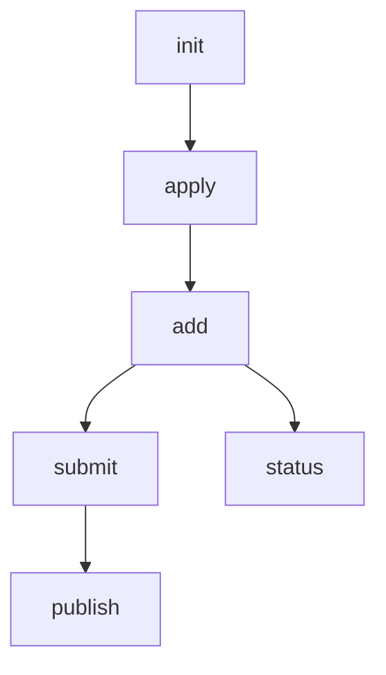

# Why I Built Dotman: Rethinking Dotfile Management for Developers

*(NOTE: I wrote this using GPT4.1 and I was just curious if I wanted to ask an LLM to write an article
for me based on it's knowledge base of questions I've asked it and what it knows about the code. 
What would it write? It's actually pretty good. But it goes a bit wild for such a simple
tool. It's almost like it's explaining the future of the human species, not just a tiny dotfile
manager project.)*

Managing dotfiles is a rite of passage for developers, but it's also a source of recurring frustration. For years, I cycled through tools like chezmoi, yadm, and stow, always hoping the next one would "just work"—and always running into the same fundamental problems. Dotman was born out of the conviction that dotfile management should be simple, explicit, and robust—without magic, without indirection, and without surprises.

---

## The Frustrations With Existing Tools: A Deep Dive

### Indirection and Fake Naming
Many popular dotfile managers rely on renaming files (e.g., `dot_zshrc`) or using symlinks to map files into place. This indirection is meant to avoid collisions or to work around the limitations of version control systems, but it comes at a cost:
- **Cognitive Overhead:** You have to remember that `dot_zshrc` in your repo actually becomes `.zshrc` in your home directory. This mapping is not always obvious, especially when onboarding a new machine or sharing configs.
- **Tool Lock-in:** If you ever want to switch tools or just use plain Git, you’re stuck with a repo full of fake names.
- **Debugging Pain:** When something goes wrong, it’s hard to know which file is actually being used by your shell or editor. This is especially true when the tool uses templates or pre-processing.

**Dotman’s approach:** Use real filenames and real directory structures. What you see in the repo is exactly what’s on disk. No tricks, no shadow repos, no "dot_" hacks.

### Symlink Nightmares
Symlinks are a classic Unix solution, but in practice, they’re fragile:
- **Platform Incompatibility:** Symlinks don’t work the same way on Windows, WSL, or in cloud environments like Dropbox or Google Drive. Some filesystems don’t support them at all.
- **Breakage on Move/Copy:** Move your home directory, or sync it with a cloud tool, and you may end up with broken links and hard-to-debug errors.
- **Security Concerns:** Symlinks can introduce subtle security issues, especially if you’re not careful about what’s being linked where.

**Dotman’s approach:** No symlinks, ever. Files are copied, not linked. This means your configs are always there, always real, and always portable.

### One-Way Workflows and Hidden Behavior
Most tools assume a one-way flow: repo → home. But real life isn’t like that:
- **You tweak a config on your laptop, but forget to stage it in the repo.**
- **You pull new changes from the repo, but your local version is newer or different.**
- **You want to see exactly what will change before anything is overwritten.**

Many tools either:
- Don’t detect changes in both directions, or
- Overwrite without asking, or
- Hide what’s happening behind layers of abstraction.

**Dotman’s approach:** Always detect changes in both directions. Always prompt before overwriting. Always show a clear diff, so you know exactly what’s about to happen.

### Git: Too Manual or Too Opaque
Some tools expect you to manage Git yourself, while others try to hide Git entirely. Both approaches have downsides:
- **Manual Git:** You have to remember to pull, commit, push, resolve conflicts, etc. This is error-prone and easy to forget.
- **Opaque Git:** The tool does things "for you" but doesn’t tell you what or why. When something goes wrong, you’re left guessing.

**Dotman’s approach:** Provide a minimal, opinionated Git UX—wrapping only the most relevant workflows for dotfiles, and always making it clear what’s happening. You see the diffs, the prompts, and the results. No surprises.

### Cross-Platform Friction
Developers work across Linux, macOS, and increasingly Windows (WSL, cloud IDEs, etc). Many tools:
- Assume Unix-only conventions
- Break on Windows or require special setup
- Don’t handle cloud sync scenarios gracefully

**Dotman’s approach:** Be cross-platform by default. No symlinks, no platform-specific hacks, no assumptions about the environment. If you can run Go, you can run Dotman.

---

## Comparison: Dotman vs. the Rest

When evaluating dotfile managers, it’s easy to get lost in a sea of features. But not all features are created equal—some solve real problems, while others introduce new ones. Here’s a breakdown of how Dotman stacks up against the most popular alternatives, and why certain features matter.

| Feature                   | Dotman | chezmoi | yadm | stow |
|---------------------------|:------:|:-------:|:----:|:----:|
| Real filenames            |   ✅   |   ❌   |  ✅  |  ✅  |
| Symlinks required         |   ❌   |   ❌   |  ❌  |  ✅  |
| Git integration           |   ✅   |   ❌   |  ❌  |  ❌  |
| Two-way sync              |   ✅   |   ❌   |  ❌  |  ❌  |
| Secrets support           |   Optional | ✅ | ✅ |  ❌  |
| Cross-platform            |   ✅   |   ✅   |  ✅  |  ❌  |
| Minimal UX                |   ✅   |   ❌   |  ❌  |  ❌  |
| Read-only mode            |   ✅   |   ❌   |  ❌  |  ❌  |

### What Do These Features Really Mean?

- **Real filenames:** You see `.zshrc` in your repo, you get `.zshrc` in your home. No translation layer, no confusion. This is crucial for transparency, onboarding, and debugging.
- **Symlinks required:** Tools that rely on symlinks (like stow) can break in cloud environments, on Windows, or when you move files. Dotman avoids this class of bugs entirely.
- **Git integration:** Dotman wraps Git for you, automating the boring stuff (pull, commit, push) but always showing you what’s happening. Tools without Git integration force you to remember every step, and mistakes are easy.
- **Two-way sync:** If you change a file in your home directory, Dotman can stage and commit it back to the repo. Most tools only go one way, which means you lose changes or have to manage them manually.
- **Secrets support:** Some tools (like chezmoi) have built-in support for managing secrets. Dotman lets you exclude or separately manage secrets, so you’re never forced to put sensitive data in your repo.
- **Cross-platform:** Dotman runs anywhere Go runs, with no hacks. Tools that depend on Unix conventions or symlinks are often Mac/Linux-only.
- **Minimal UX:** Dotman is designed to be clear, not clever. You always get a prompt before overwriting, and you always see a diff. No accidental data loss.
- **Read-only mode:** Useful for cloud/dev environments where you want to load config but never write back. Dotman supports this out of the box.

### Pros and Cons Table

| Tool     | Pros                                             | Cons                                                       |
|----------|--------------------------------------------------|------------------------------------------------------------|
| Dotman   | Simple, transparent, real files, cross-platform  | Newer, fewer advanced features than some alternatives      |
| chezmoi  | Feature-rich, secrets mgmt, templates            | Indirection, learning curve, not real filenames             |
| yadm     | Git-based, flexible                             | Manual Git, less automation, less opinionated               |
| stow     | Simple, Unixy                                   | Symlink headaches, not cross-platform, no Git integration   |

#### Why Certain Features Are Bad (or Good)

- **Symlinks:** While symlinks are elegant in pure Unix environments, they’re a nightmare for portability. If you’ve ever synced your dotfiles with Dropbox or tried to use them in WSL, you know how quickly things can break. Symlinks also make it hard to audit what’s actually on disk—sometimes the file you’re editing isn’t the one your shell is reading.
- **Fake naming:** Tools that rename files (e.g., `dot_bashrc`) introduce friction when switching tools or sharing with others. You have to mentally map every file, and scripts that expect `.bashrc` won’t find it.
- **Opaque automation:** Tools that “just do it for you” can be dangerous. If you don’t see a diff or a prompt, it’s easy to overwrite something important by accident. Dotman’s philosophy is to always show you what’s about to happen.
- **Manual Git:** Git is powerful, but it’s also easy to mess up. Forgetting to pull before pushing, or pushing without resolving conflicts, can leave your repo in a bad state. Dotman automates the safe path, but never hides the details.

---

## The "Easy" Problems That Weren't

I initially thought dotfile management was a solved problem. But as I tried to automate my workflow, I kept hitting edge cases:
- **Bidirectional changes:** What if the same file changes in both places? Most tools punt on this, but Dotman prompts you to resolve it.
- **Staging and committing from $HOME:** How do I stage and commit changes from `$HOME` back to the repo, without manual Git? Dotman makes this a single command.
- **Avoiding merge conflicts:** Dotman always pulls before submitting or applying, unless you explicitly opt out, reducing the chance of conflicts.
- **Minimal UX:** I wanted a tool that never overwrites without asking, and always shows a clear diff.

**These problems were trickier than expected, and existing tools either ignored them or made them harder to solve.**

---

## The Dotman Methodology: Simplicity, Transparency, and Control

Dotman is built on a few core principles:

- **The Git repo is the source of truth.** All changes flow from or to the repo, never to a shadow copy.
- **No symlinks, no indirection.** Files are copied, not linked or renamed.
- **Two-way sync with clear prompts.** Dotman detects changes both ways and always asks before overwriting.
- **Minimal, task-specific Git UX.** Only the commands that matter for dotfiles: add, apply, submit, publish.
- **Cross-platform by default.** No hacks required for Linux, macOS, or Windows.

### Dotman Workflow Diagram

---

## How Dotman Works (In Detail)

- **`init`**: Clone a repo, set up the working directory. No shadow directory, no magic.
- **`add`**: Copy a file from `$HOME` into the repo. No renaming, just a real file.
- **`apply`**: Copy files from the repo into `$HOME`, showing diffs and prompting before overwriting. If both sides changed, you get a real conflict prompt.
- **`submit`**: Stage and commit changes from `$HOME` back to the repo, with a single command.
- **`publish`**: Push changes to the remote repo. Dotman will always pull before pushing, unless you use `--no-pull`.

---

## Why Build a New Tool?

Because the existing solutions were either too complex, too opinionated, or too opaque. I wanted a tool that:
- Is easy to reason about
- Makes every action explicit
- Works everywhere
- Lets me use Git, but only as much as I need

### Common Scenarios Where Dotman Shines

- **Onboarding a new machine:** One command to clone and apply your config, with clear prompts for every change.
- **Sharing configs across OSes:** No symlinks, no hacks, no breakage.
- **Keeping secrets out of Git:** Dotman can ignore or separately manage secrets, unlike some tools that force everything into the repo.
- **Simple recovery:** Accidentally overwrote your `.zshrc`? Dotman makes it easy to re-apply from the repo or submit changes the other way.

---

## Conclusion

Dotman isn’t trying to replace Git or reinvent dotfile management from scratch. It’s about making the common workflows simple, transparent, and robust—so you can spend less time fighting your config and more time coding.

If you’ve ever been frustrated by hidden behavior, broken symlinks, or confusing dotfile repos, Dotman might be the tool you’ve been looking for.

---

*Interested in contributing or want to see more features? Open an issue or PR on GitHub!*
